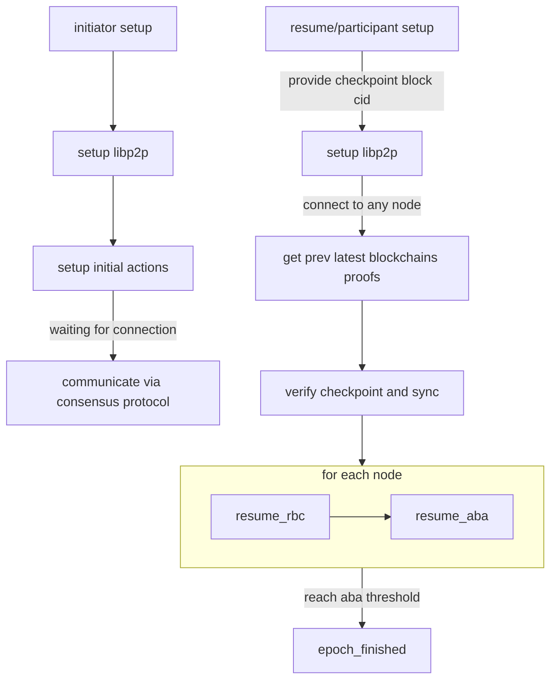

# RBC recovery
|remote status for node x|local status for node x|local action|remote action|
|---|---|---|---|
|not rec rbc_val of x|not rec rbc_val of x|broadcast unknown|ignore|
|not rec rbc_val of x|not rec enough rbc_echo of x|broadcast echo|ignore|
|not rec rbc_val of x|not rec enough rbc_ready of x|broadcast ready|ignore|
|not rec enough rbc_echo of x|not rec rbc_val of x|broadcast unknown|return rbc_val if self==x else rbc_echo|
|not rec enough rbc_echo of x|not rec enough rbc_echo of x|broadcast echo|return rbc_echo|
|not rec enough rbc_echo of x|not rec enough rbc_ready of x|broadcast ready|ignore|
|(not) rec enough rbc_ready of x|not rec rbc_val|broadcast unknown|return rbc_val if self==x else rbc_echo|
|(not) rec enough rbc_ready of x|not rec enough rbc_echo|broadcast echo|return rbc_echo|
|(not) rec enough rbc_ready of x|not rec enough rbc_ready|broadcast ready|return rbc_ready|

# ABA recovery