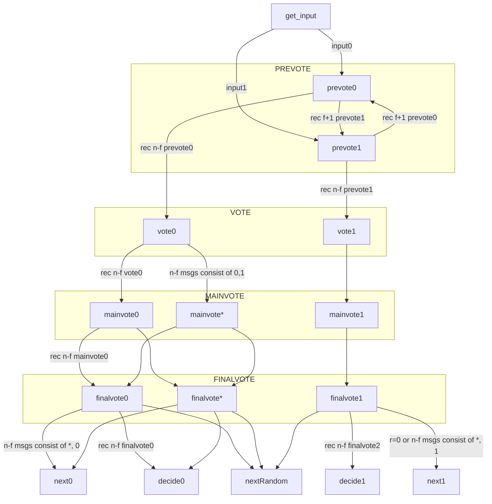

### ABA

Asynchronous binary Byzantine agreement 
* Validity
如果所有诚实节点propose v，那么任意诚实节点终将decide v
* Agreement
如果一个诚实节点decide v，那么所有诚实节点终将decide v
* Termination
所有诚实节点终将decide某个值
* Integrity
没有诚实节点会decide多次

### RABA
Reproposable Asynchronous Binary Agreement
* Validity

如果所有诚实节点propose v并且从未repropose !v，那么任意诚实节点终将decide v
* Unanimous termination

如果所有诚实节点propose v并且从未repropose !v，那么所有诚实节点终将decide 某个值
* Agreement

如果一个诚实节点decide v，那么所有诚实节点终将decide v
* Biased validity

如果f+1个诚实节点propose 1，任何诚实节点终将decide 1
* Biased termination

设Q为所有诚实节点的集合，Q1为propose 1并且从未propose 0的诚实节点，Q2为propose 0并且稍后repropose 1的诚实节点。如果Q2不为空且Q=Q1 U Q2, 那么所有诚实节点终将decide
* Integrity

没有诚实节点会decide多次

### RBC
* Validity

If a correct replica 𝑝𝑠 r-broadcasts a message 𝑚, then
𝑝𝑠 eventually r-delivers 𝑚.
* Agreement

If some correct replica r-delivers a message 𝑚, then
every correct replica eventually r-delivers 𝑚.
* Integrity

For any message 𝑚, every correct replica r-delivers 𝑚
at most once. Moreover, if a replica r-delivers a message 𝑚 with
sender 𝑝𝑠 , then 𝑚 was previously broadcast by replica 𝑝𝑠 .

hreshold PRF scheme

### Quadratic ABA state diagram for each round

### 缓存机制
* 缓存相同epoch, session_id 且 rec_round - current_round <= 1 下的所有消息

### 恢复机制
* 在一个状态下超时后，再次广播该状态

* 当收到过期的消息（距离大于1），返回当时广播的消息

### 潜在威胁
* 通过广播finalvote-any或mainvote-any或vote-any 干扰final vote output。解决方案：每阶段的广播需要携带证明