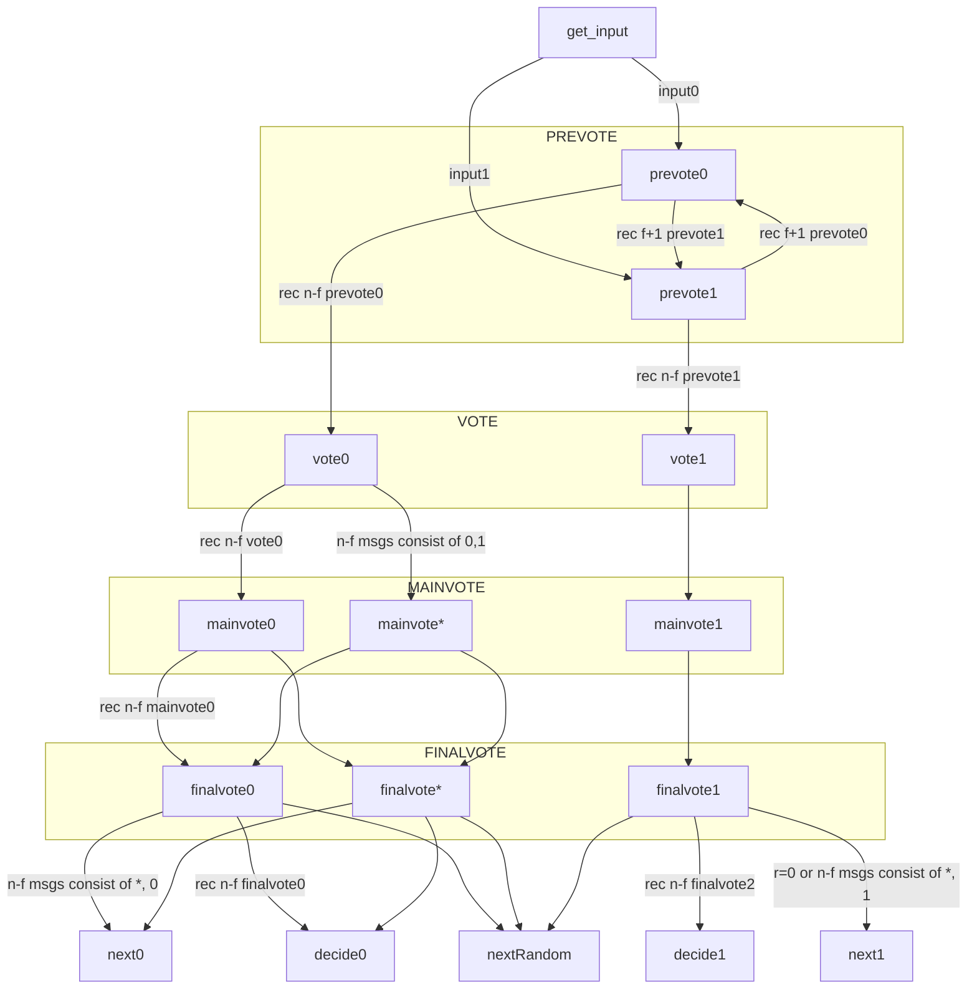

### Quadratic ABA state diagram for each round

```mermaid
graph TD;

    get_input --> |input0|prevote0
    get_input --> |input1|prevote1
    subgraph PREVOTE
        prevote0
        prevote1
    end
    prevote0-->|rec n-f prevote0|vote0;

    prevote0-->|rec f+1 prevote1|prevote1
    prevote1-->|rec f+1 prevote0|prevote0[prevote0]

    subgraph VOTE
        vote1
        vote0
    end
    prevote1-->|rec n-f prevote1|vote1;

    subgraph MAINVOTE
        mainvote1
        mainvoteStar0
        mainvote0
    end
    vote0-->|rec n-f vote0|mainvote0;
    vote0-->|n-f msgs consist of 0,1|mainvoteStar0[mainvote*];
    vote1-->mainvote1;

    subgraph FINALVOTE
        finalvote1
        finalvoteStar0
        finalvote0
    end
    mainvote0-->|rec n-f mainvote0|finalvote0;
    mainvote0-->finalvoteStar0[finalvote*];
    mainvoteStar0-->finalvoteStar0;
    mainvote1-->finalvote1;
    mainvoteStar0-->finalvote0;

    finalvote1-->|rec n-f finalvote2|decide1
    finalvote0-->|n-f msgs consist of *, 0|next0
    finalvoteStar0-->next0
    finalvote1-->|r=0 or n-f msgs consist of *, 1|next1
    finalvote0-->|rec n-f finalvote0|decide0
    finalvote0-->nextRandom
    finalvoteStar0-->nextRandom
    finalvoteStar0-->decide0
    finalvote1-->nextRandom
```

### 缓存机制
* 缓存相同epoch, session_id 且 rec_round - current_round <= 1 下的所有消息

### 恢复机制
* 在一个状态下超时后，再次广播该状态

* 当收到过期的消息（距离大于1），返回当时广播的消息

### 潜在威胁
* 通过广播finalvote-any或mainvote-any或vote-any 干扰final vote output。解决方案：每阶段的广播需要携带证明