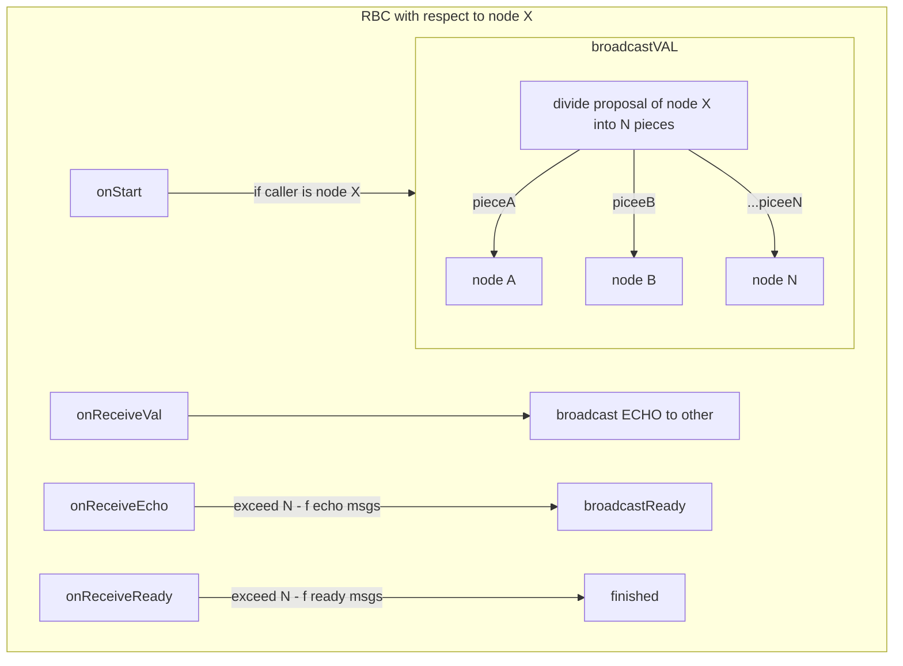

## 恢复机制：

触发时机：rbc阶段超时或冷启动协议进行恢复时
当前epoch 结束的rbc实例小于n-f时，对每一个未结束的rbc实例：
* 如果处于await echo的状态，重新广播VAL，并且广播query echo.已完成await echo的节点收到query echo时返回echo消息。
* 如果处于await ready的状态，重新广播echo，并且广播query ready. 已完成await ready 的节点收到query ready 时返回ready消息。
