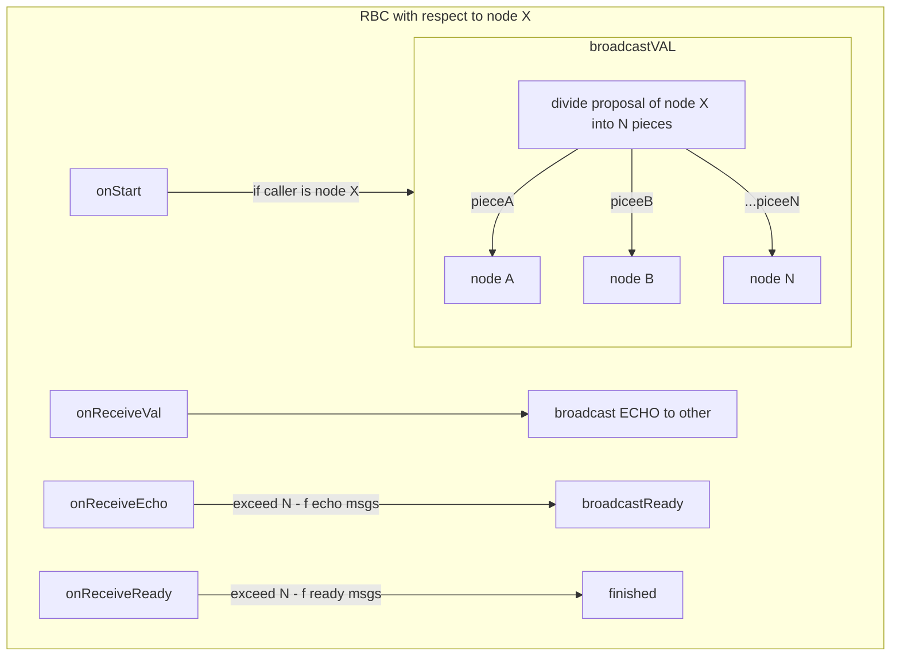

```mermaid
graph TD;
subgraph RBC with respect to node X
subgraph broadcastVAL
step1[divide proposal of node X into N pieces]-->|pieceA| a[node A]
step1 --> |piceeB| b[node B]
step1 --> |...piceeN| n[node N]
end

onReceiveVal --> broadcastEcho[broadcast ECHO to other]

onStart --> |if caller is node X|broadcastVAL
onReceiveEcho --> |exceed N - f echo msgs|broadcastReady
onReceiveReady --> |exceed N - f ready msgs|finished
end

```