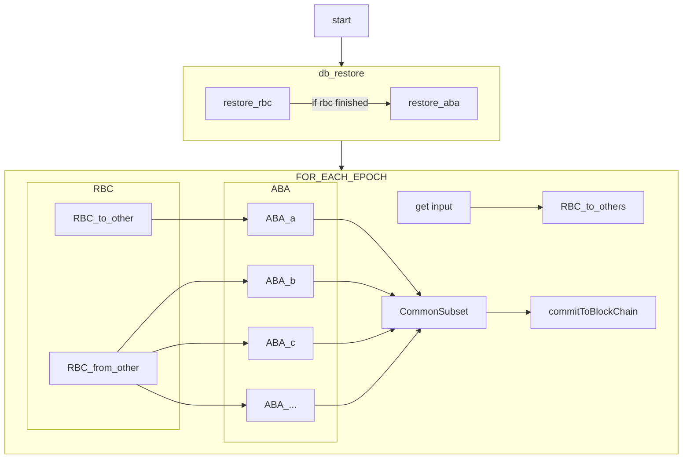

```mermaid
graph TD;
    start --> db_restore
    subgraph db_restore
        restore_rbc -->|if rbc finished|restore_aba
    end
    db_restore --> FOR_EACH_EPOCH
    subgraph FOR_EACH_EPOCH
        getinput[get input]
        subgraph RBC
            RBC_to_other
            RBC_from_other
        end
        getinput --> RBC_to_others
        subgraph ABA
            RBC_from_other --> ABA_b
            RBC_from_other --> ABA_c
            RBC_from_other --> ABA_...
            RBC_to_other --> ABA_a
        end
        ABA_a --> CommonSubset
        ABA_b --> CommonSubset
        ABA_c --> CommonSubset
        ABA_... --> CommonSubset
        CommonSubset --> commitToBlockChain
    end
```